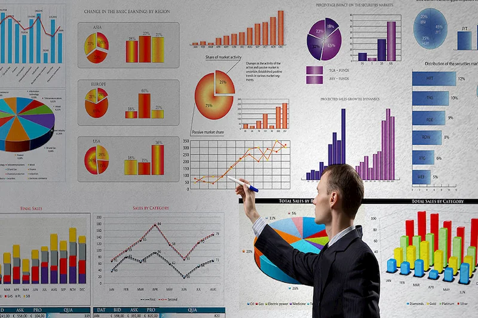

<h2 style="text-align: center;">
Financial Dashboard</h2>

 
 

<a href="https://www.datapine.com/dashboard-examples-and-templates/finance" rel="nofollow" target="_blank">Ir al Dashboard aquí.</a>

<h3>
Descripción:</h3>

Potente herramienta de análisis  financiero con cuatro (4) niveles de interpretación para presentación de resultados, basado en el Estado de Ganancias y Pérdidas (Estado de Resultados). Tiene la opción de exportar información en Power Point  o PDF , ambos con highlight automáticos personalizables.&nbsp; 
 

Un panel de control financiero (Financial Dashboard) es una herramienta de "inteligencia empresarial" que ayuda a rastrear todos los KPI financieros relevantes, permite una visión amplia y eficiente del negocio y facilita el seguimiento de los márgenes de ventas y ganancias en detalle para cumplir y superar los objetivos financieros proyectados de un área, línea de negocio, departamento, empresa o grupo de ellas.

 

La herramienta fue desarrollada por Jesús B. Zerpa. En la primera versión, se diseñó para la presentación de resultados financieros de la V.P de Finanzas de un importante Grupo Empresarial, en cuya actividad económica se incluyen: Producción, distribución, venta al mayor, comercialización  y una cadena de tiendas al detal.&nbsp;

 

El objetivo planteado al finalizar  el diseño de esta herramienta era centralizar  y actualizar en un solo reporte, información que contenían varios entregables, engranarlos con una secuencia lógica, óptima para el análisis financiero cualitativo y cuantitativo,  automatizarlo y darle una imagen de presentación para el  cierre mensual.&nbsp;

 

Además, hacerlo interactivo para buscar información pasada minimizando tiempos (al momento de la presentación) y añadirle otros elementos visuales. Destacan: el peso liviano y la seguridad que impide que el archivo sea dañado o abierto por terceros no autorizados (VB).&nbsp;

 

Esta nueva versión,  tiene una serie de optimizaciones para  hacerlo personalizable y  el anexo del asistente que permite hacer la inducción al usuario de manera interactiva sin necesidad de intermediarios.  Así como la integración a <a href="https://powerbi.microsoft.com/es-es/" rel="nofollow" target="_blank">Power BI</a> y pasar una extensión del diseño de la hoja a la plataforma BI. Lo que convierte a la herramienta en un modelo y no una hoja de excel. 
 
<a href="https://www.datapine.com/dashboard-examples-and-templates/finance" rel="nofollow" target="_blank">Ir al Dashboard aquí.</a>

 

